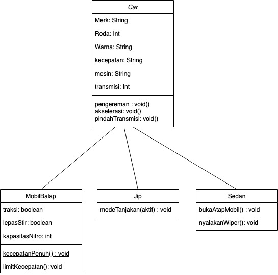

# Tugas 4 OOP
Berikut ini merupakan tugas dari mata kuliah Object Oriented Programming di Kampus
*STMIK AMIK BANDUNG*.

Soal:
Buat program inheritance dengan tema bebas (minimal 3 class yang diturunkannya).

---
## Illustrasi Class

Gambar 1: Ilustrasi Kelas Yang akan di buat. 
*note: Mohon untuk dijadikan referensi, jangan melakukan penjiplakan*
